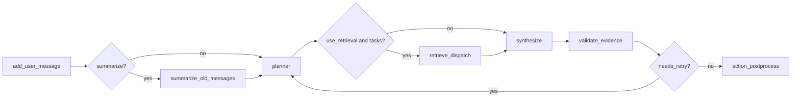

# DocuMate
> 공식 문서 검색, 로컬 노트북 RAG, 업로드 파일 검색, 멀티턴 세션 메모리를 결합한 LangGraph 기반 학습 보조 에이전트

이 저장소는 2025년 부트캠프 팀 결과물을 바탕으로 현재 런타임 구조와 평가 체계를 분리해 유지보수 중인 개인 리팩터링 버전입니다. 현재 코드는 `src/graph_builder.py`, `src/make_graph.py`, `src/llm.py`, `src/nodes/*` 중심으로 재편되어 있으며, README는 그 구조를 기준 문서로 유지합니다.

- [벤치마크 상세](docs/benchmarking.md)
- [변경 이력](CHANGELOG.md)
- [레거시 산출물 안내](archive/README.md)

## 1. 핵심 기능

| 기능 | 설명 |
|---|---|
| 멀티턴 세션 메모리 | 세션별 메시지 히스토리와 요약 메모리를 유지하고, FastAPI 레이어에서 TTL + LRU 캐시로 세션을 관리합니다. |
| 공식 문서 검색 | `tavily_search`가 `src/domain_docs.py`에 정의된 공식 문서 도메인 집합을 기본 화이트리스트로 사용합니다. |
| 로컬 노트북 RAG | `src/rag_build.py`가 `data/`와 `uploads/` 아래 `.ipynb`를 증분 인덱싱하고, `rag_search`가 `data/index`를 조회합니다. |
| 업로드 파일 검색 | 현재 세션의 업로드 파일 `.py`, `.ipynb`에 대해 임시 Chroma retriever를 구성하고 `upload_search`로 조회합니다. |
| 구조화된 evidence 응답 | `/agent`는 `response.answer`와 `response.evidence[]`를 반환하고, `debug.observed_evidence`와 함께 평가에 사용됩니다. |
| evidence 검증 후 재시도 | evidence가 없거나 점수가 낮으면 planner -> retrieval -> synthesis 흐름을 최대 1회 재시도하고, 실패 시 불확실성 응답을 반환합니다. |
| 후처리 도구 | 사용자가 요청하면 `save_text`로 답변을 `.txt` 파일로 저장하고 `slack_notify`로 Slack DM 또는 채널 전송을 수행합니다. |
| UTF-8 안전 실행 | `src/runtime_encoding.py`와 `src/main.py`가 UTF-8 모드 재실행과 표준 입출력 재설정을 처리합니다. |

## 2. 현재 아키텍처

- `src/main.py`: CLI 실행과 FastAPI/Streamlit 백그라운드 서비스 시작, 중지
- `src/web/main.py`: `/agent`, `/download/{filename}`를 제공하는 FastAPI 앱
- `src/web/streamlit_app.py`: 웹 UI
- `src/agent_manager.py`: 세션별 LangGraph 실행 결과를 정리하고 evidence, debug 정보를 추출
- `src/graph_builder.py`: 설정, 도구 레지스트리, LLM 레지스트리, 각 노드 팩토리를 조립하는 진입점
- `src/llm.py`: planner, synthesizer, summarizer 모델 레지스트리 구성
- `src/make_graph.py`: LangGraph 노드, 라우터, edge를 정의하는 그래프 토폴로지
- `src/nodes/session.py`: `add_user_message`, `summarize_old_messages`
- `src/nodes/planner.py`: `planner`
- `src/nodes/retrieval.py`: `retrieve_dispatch`
- `src/nodes/synthesis.py`: `synthesize`
- `src/nodes/validation.py`: `validate_evidence`
- `src/nodes/actions.py`: `action_postprocess`
- `src/nodes/state.py`: 그래프 상태 타입



문서의 기준 다이어그램은 위 Mermaid입니다. CLI 실행 중 `draw_mermaid_png()`가 성공하면 루트에 `graph.png`가 생성될 수 있지만, 이는 부가 산출물일 뿐 기준 문서는 아닙니다.

## 3. 프로젝트 구조

```text
.
├── CHANGELOG.md
├── archive/
│   ├── legacy_code/
│   ├── team_docs/
│   └── README.md
├── data/
│   ├── benchmarks/
│   │   ├── config.toml
│   │   └── fixtures/
│   └── index/                     # src.rag_build.py가 생성하는 Chroma 인덱스
├── docs/
│   ├── assets/
│   │   └── benchmark_history.svg
│   └── benchmarking.md
├── output/
│   ├── benchmarks/
│   └── save_text/
├── script/
│   ├── check_encoding.py
│   └── web_services_state.json
├── src/
│   ├── agent_manager.py
│   ├── domain_docs.py
│   ├── evidence.py
│   ├── graph_builder.py
│   ├── llm.py
│   ├── main.py
│   ├── make_graph.py
│   ├── planner_schema.py
│   ├── prompts.py
│   ├── rag_build.py
│   ├── runtime_encoding.py
│   ├── settings.py
│   ├── slack_utils.py
│   ├── tools.py
│   ├── upload_helpers.py
│   ├── eval/
│   ├── nodes/
│   ├── util/
│   └── web/
├── tests/
│   ├── core/
│   ├── eval/
│   └── web/
├── uploads/
├── pyproject.toml
└── README.md
```

레거시 코드와 이전 팀 산출물은 [archive/README.md](archive/README.md)에 분리해 두었습니다.

## 4. 설치 및 실행

### 4.1 의존성 설치

```bash
uv sync
```

### 4.2 환경변수 파일 준비

```bash
cp .env.example .env
# Windows PowerShell
Copy-Item .env.example .env
```

필수 값
- `OPENAI_API_KEY`
- `TAVILY_API_KEY`

### 4.3 로컬 노트북 인덱스 생성

로컬 RAG를 사용하려면 먼저 `data/index`를 생성해야 합니다.

```bash
uv run python -m src.rag_build
```

이 명령은 `data/`와 `uploads/` 아래 `.ipynb` 파일을 증분 인덱싱합니다.

### 4.4 CLI 실행

```bash
uv run python -m src.main
```

`src.main`은 현재 인터프리터가 UTF-8 모드가 아니면 내부적으로 `-X utf8`로 재실행합니다.

### 4.5 웹 서비스 실행

```bash
uv run python -m src.main --mode startweb
uv run python -m src.main --mode stopweb
```

- FastAPI: `http://localhost:8000`
- Streamlit: `http://localhost:8501`
- 시작 시 프로세스 상태는 `script/web_services_state.json`에 기록됩니다.

### 4.6 FastAPI/Streamlit 직접 실행

```bash
uv run python -X utf8 -m uvicorn src.web.main:app --host 0.0.0.0 --port 8000
uv run python -X utf8 -m streamlit run src/web/streamlit_app.py --server.port 8501
```

직접 실행 시에는 `-X utf8` 또는 `PYTHONUTF8=1` 설정을 유지하는 편이 안전합니다.

## 5. 환경변수

| 이름 | 기본값 | 설명 |
|---|---|---|
| `OPENAI_API_KEY` | 없음 | OpenAI 호출에 필요 |
| `TAVILY_API_KEY` | 없음 | Tavily 검색에 필요 |
| `CHAT_MODEL` | `gpt-5-mini` | synthesis 모델 |
| `PLANNER_MODEL` | `gpt-5-nano` | planner 모델 |
| `SUMMARY_MODEL` | `gpt-5-mini` | 요약 모델 |
| `DOCS_SEARCH_TIMEOUT_SECONDS` | `8` | Tavily docs retrieval fail-fast timeout(초) |
| `SYNTHESIS_TIMEOUT_SECONDS` | `8` | synthesizer timeout(초) |
| `SYNTHESIS_MAX_RETRIES` | `1` | synthesizer 재시도 횟수 |
| `SYNTHESIS_MAX_TOKENS` | `900` | synthesizer max_tokens |
| `VERBOSE` | `true` | CLI 및 내부 로깅 상세도 |
| `FASTAPI_URL` | `http://localhost:8000` | Streamlit에서 사용할 API 주소 |
| `SESSION_TTL_SECONDS` | `1800` | 세션 TTL |
| `MAX_ACTIVE_SESSIONS` | `200` | 세션 캐시 최대 개수 |
| `SESSION_CLEANUP_INTERVAL_SECONDS` | `60` | 세션 cleanup 주기 |
| `GENERATED_FILE_TTL_SECONDS` | `86400` | `save_text` 생성 파일 TTL |
| `FILE_CLEANUP_INTERVAL_SECONDS` | `60` | 파일 cleanup 주기 |
| `SLACK_BOT_TOKEN` | 없음 | Slack 전송용 토큰 |
| `SLACK_DEFAULT_USER_ID` | 없음 | 기본 DM 대상 |
| `SLACK_DEFAULT_DM_EMAIL` | 없음 | 기본 DM 이메일 |
| `JUDGE_MODEL` | `gpt-5-mini` | 벤치마크 judge 모델 |
| `BENCHMARK_ENDPOINT` | `http://localhost:8000` | 벤치마크 기본 대상 |
| `BENCHMARK_JUDGE_ENABLED` | `true` | judge 사용 여부 |

## 6. 업로드, 저장, 세션 정책

- 업로드 파일은 `uploads/<session_id>/` 하위 경로만 허용됩니다.
- 허용 확장자는 `.py`, `.ipynb`입니다.
- `upload_search`는 현재 세션에 연결된 업로드 파일만 조회합니다.
- `save_text`가 생성한 파일은 `output/save_text/*.txt`에 저장됩니다.
- 업로드 디렉터리는 `SESSION_TTL_SECONDS`, 생성 파일은 `GENERATED_FILE_TTL_SECONDS` 기준으로 자동 정리됩니다.
- 만료된 저장 파일은 `/download/{filename}` 요청 시 `404 Not Found`가 반환될 수 있습니다.

## 7. API 계약

### 7.1 `POST /agent`

요청 예시:

```json
{
  "query": "NumPy broadcasting을 간단히 설명해줘",
  "session_id": "demo-session",
  "upload_file_path": "uploads/demo-session/sample_pipeline.ipynb",
  "include_debug": true,
  "slack_user_id": "U12345678",
  "slack_email": "user@example.com",
  "slack_channel_id": "C12345678"
}
```

응답 예시:

```json
{
  "response": {
    "answer": "NumPy broadcasting은 서로 다른 shape의 배열 연산을 가능하게 하는 규칙입니다.",
    "evidence": [
      {
        "kind": "official",
        "tool": "tavily_search",
        "source_id": "url:https://numpy.org/doc/stable/user/basics.broadcasting.html",
        "url_or_path": "https://numpy.org/doc/stable/user/basics.broadcasting.html",
        "title": "Broadcasting",
        "snippet": "Broadcasting provides a means of vectorizing array operations...",
        "score": 0.98
      }
    ]
  },
  "trace": "Session ID: demo-session, Request ID: abcd1234, Agent ID: 12345678",
  "file_path": "output/save_text/response_20260306_103000.txt",
  "debug": {
    "tool_calls": ["tavily_search", "save_text"],
    "tool_call_count": 2,
    "latency_ms_server": 1842,
    "latency_breakdown": {
      "server_total_ms": 1842,
      "graph_total_ms": 1765,
      "upload_retriever_build_ms": null,
      "stage_totals_ms": {
        "summarize_ms": 0,
        "planner_ms": 34,
        "retrieval_total_ms": 911,
        "synthesis_total_ms": 702,
        "validation_ms": 81,
        "action_postprocess_ms": 37
      },
      "stage_attempts": [
        {"stage": "planner", "attempt": 1, "latency_ms": 34, "status": "llm"},
        {"stage": "retrieval", "attempt": 1, "latency_ms": 911, "status": "success"}
      ],
      "retrieval_routes": [
        {"route": "docs", "tool": "tavily_search", "attempt": 1, "latency_ms": 884, "status": "success"}
      ],
      "synthesis_attempts": [
        {"attempt": 1, "mode": "structured_only", "structured_ms": 702, "fallback_ms": null, "total_ms": 702}
      ]
    },
    "token_usage": {
      "prompt_tokens": 642,
      "completion_tokens": 153,
      "total_tokens": 795
    },
    "model_name": "gpt-5-mini",
    "errors": [],
    "observed_evidence": [
      {
        "kind": "official",
        "tool": "tavily_search",
        "source_id": "url:https://numpy.org/doc/stable/user/basics.broadcasting.html",
        "url_or_path": "https://numpy.org/doc/stable/user/basics.broadcasting.html",
        "title": "Broadcasting",
        "snippet": "Broadcasting provides a means of vectorizing array operations...",
        "score": 0.98
      }
    ],
    "retry_context": {
      "attempt": 0,
      "max_retries": 1,
      "retry_reason": null,
      "retrieval_feedback": null,
      "evidence_start_index": 0,
      "retrieval_error_start_index": 0,
      "score_avg": null
    }
  }
}
```

### 7.2 `GET /download/{filename}`

- `save_text` 결과 파일 다운로드용 엔드포인트입니다.
- 절대 경로나 상위 디렉터리 탈출 경로는 거부됩니다.

## 8. 검증 현황

- 테스트: `uv run pytest -q` 기준 현재 저장소에서 `75 passed`
- 인코딩 검사: `uv run python script/check_encoding.py` 기준 `Encoding check passed. Checked 82 tracked text files.`
- 온라인 벤치마크: 상세 명령, 최신 저장 런 요약, Hard Gate, 추세는 [docs/benchmarking.md](docs/benchmarking.md)에서 관리합니다.
- 현재 저장소에 남아 있는 최신 완전한 온라인 리포트는 `20260307_101108`이며, 일부 Hard Gate는 아직 미통과 상태입니다.

## 9. 테스트 및 검증

```bash
uv run pytest -q
uv run python script/check_encoding.py
```

벤치마크 생성, 실행, 리포트 재생성, 이력 확인 명령은 [docs/benchmarking.md](docs/benchmarking.md)에서 별도로 정리합니다.

## 10. 인코딩 정책

- 텍스트 파일 기본 인코딩은 UTF-8 no BOM입니다.
- `.editorconfig`는 `charset = utf-8`을 기본값으로 사용합니다.
- Windows PowerShell 5.1에서는 콘솔 출력 인코딩 때문에 한글이 깨져 보일 수 있습니다.
- 직접 실행 시 UTF-8 모드를 강제하려면 `-X utf8` 또는 `PYTHONUTF8=1`을 사용하세요.

런타임 인코딩 점검 예시:

```bash
uv run python -X utf8 -c "import sys, locale; print(sys.flags.utf8_mode, sys.stdout.encoding, locale.getpreferredencoding(False))"
```

## 11. 참고 링크

- LangChain: https://docs.langchain.com/oss/python/langchain/overview
- Streamlit: https://docs.streamlit.io/
- FastAPI: https://fastapi.tiangolo.com/
- Pydantic: https://docs.pydantic.dev/latest/
