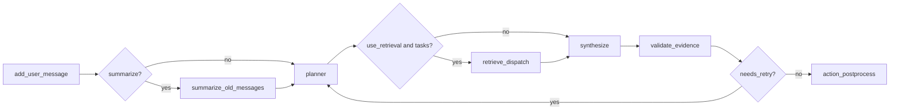

# DocuMate
> 공식 문서 검색, 로컬 노트북 RAG, 업로드 파일 검색, 멀티턴 세션 메모리를 결합한 LangGraph 기반 학습 보조 에이전트

이 저장소는 2025년 부트캠프 팀 결과물을 바탕으로 현재 런타임 구조와 평가 체계를 분리해 유지보수 중인 개인 리팩터링 버전입니다. 현재 기준 문서는 `src/graph_builder.py`, `src/make_graph.py`, `src/llm.py`, `src/nodes/*`, `src/tools/*`, `src/web/*`의 실제 동작을 따릅니다.

- [벤치마크 상세](docs/benchmarking.md)
- [변경 이력](CHANGELOG.md)
- [레거시 산출물 안내](archive/README.md)

## 1. 핵심 기능

| 기능 | 설명 |
|---|---|
| 멀티턴 세션 메모리 | 세션별 메시지 히스토리와 요약 메모리를 유지하고, FastAPI 레이어에서 TTL + LRU 캐시로 세션을 관리합니다. |
| 공식 문서 검색 | `tavily_search`는 `src/tools/docs_search.py`의 도메인 + 경로 prefix allowlist만 통과시키며, `train_test_split`, `groupby`, `broadcasting` 같은 심볼 기반 query hint와 fallback query로 공식 문서 검색을 보정합니다. |
| 로컬 노트북 RAG | `src/rag_build.py`가 `data/`와 `uploads/` 아래 `.ipynb`를 증분 인덱싱하고, `rag_search`가 `data/index`를 조회합니다. |
| 업로드 파일 검색 | 현재 세션의 업로드 파일 `.py`, `.ipynb`에 대해 임시 Chroma retriever를 구성하고 `upload_search`로 조회합니다. |
| 경로별 evidence 검증 | `src/nodes/validation.py`는 `docs`, `upload`, `local` 경로별로 evidence를 검증합니다. `docs`는 점수 또는 lexical match를, `upload`와 `local`은 식별자/키워드 일치 여부를 함께 사용합니다. |
| 선택적 재시도 | 자동 retrieval 재시도는 `docs` 단독 요청 또는 `docs + upload` 혼합 요청에서 `docs`만 실패한 경우에만 수행합니다. 혼합 요청 재시도 시 성공한 upload evidence와 진단 정보는 내부적으로 보존해 재사용합니다. |
| 결정적 grounded 응답 | 업로드 중심 요청에서 primary evidence가 1~2개면 `src/nodes/synthesis.py`가 LLM을 거치지 않고 `deterministic_grounded_direct` 경로로 grounded payload를 바로 생성합니다. |
| 구조화된 API/디버그 응답 | `/agent`는 `response.answer`, `response.claims`, `response.evidence`, `response.confidence`를 반환하고, `debug.retrieval_diagnostics`, `debug.planner_diagnostics`, `debug.retry_context`, `debug.latency_breakdown`으로 내부 동작을 노출합니다. |
| 후처리 도구 | 사용자가 요청하면 `save_text`로 답변을 `.txt` 파일로 저장하고 `slack_notify`로 Slack DM 또는 채널 전송을 수행합니다. |
| UTF-8 안전 실행 | `src/runtime_encoding.py`, `src/cli.py`, `src/service_manager.py`가 UTF-8 모드 재실행과 표준 입출력 재설정을 처리합니다. |

## 2. 현재 아키텍처

- `src/cli.py`: CLI 실행 엔트리
- `src/service_manager.py`: FastAPI/Streamlit 백그라운드 서비스 시작, 중지
- `src/web/app.py`: lifespan, middleware, router 조립을 담당하는 FastAPI 앱
- `src/web/routes.py`: `/agent`, `/download/{filename}` 라우터
- `src/web/schemas.py`: FastAPI 공개 요청/응답 스키마
- `src/web/session_store.py`: 세션 TTL/LRU 캐시
- `src/web/cleanup.py`: 업로드/생성 파일 cleanup, path validation
- `src/web/streamlit_app.py`: 웹 UI
- `src/agent_manager.py`: 세션별 LangGraph 실행 결과를 정리하고 evidence, debug 정보를 추출
- `src/graph_builder.py`: 설정, 도구 레지스트리, LLM 레지스트리, 각 노드 팩토리를 조립하는 진입점
- `src/llm.py`: planner, synthesizer, summarizer 모델 레지스트리 구성
- `src/make_graph.py`: LangGraph 노드, 라우터, edge를 정의하는 그래프 토폴로지
- `src/latency.py`: stage/retrieval/synthesis latency 모델과 집계
- `src/tools/docs_search.py`: 공식 문서 검색 allowlist, query hint, Tavily 호출
- `src/nodes/session.py`: `add_user_message`, `summarize_old_messages`
- `src/nodes/planner.py`: `planner`
- `src/nodes/retrieval.py`: `retrieve_dispatch`
- `src/nodes/retry.py`: retry context, retrieval feedback, selective retry 규칙
- `src/nodes/synthesis.py`: `synthesize`
- `src/nodes/validation.py`: `validate_evidence`
- `src/nodes/actions.py`: `action_postprocess`
- `src/nodes/state.py`: 그래프 상태 타입


```mermaid
flowchart LR
    A["add_user_message"] --> B{"summarize?"}
    B -- yes --> C["summarize_old_messages"]
    B -- no --> D["planner"]
    C --> D
    D --> E{"use_retrieval and tasks?"}
    E -- yes --> F["retrieve_dispatch"]
    E -- no --> G["synthesize"]
    F --> G
    G --> H["validate_evidence"]
    H --> I{"needs_retry?"}
    I -- yes --> D
    I -- no --> J["action_postprocess"]
```

문서의 기준 다이어그램은 위 Mermaid입니다. 그래프 PNG 덤프는 기본적으로 생성하지 않으며, 필요할 때만 `src.cli --dump-graph <path>`로 수동 생성합니다.

## 3. 프로젝트 구조

핵심 경로만 발췌하면 다음과 같습니다.

```text
.
├── CHANGELOG.md
├── archive/
│   └── README.md
├── data/
│   ├── benchmarks/
│   │   ├── config.toml
│   │   └── fixtures/
│   └── index/                     # src.rag_build.py가 생성하는 Chroma 인덱스
├── docs/
│   ├── assets/
│   │   └── benchmark_history.svg
│   └── benchmarking.md
├── output/
│   ├── benchmarks/                # 온라인 벤치마크 산출물
│   ├── runtime/                   # 런타임 로그 및 서비스 상태 파일
│   └── save_text/                 # save_text 결과물
├── script/
│   └── check_encoding.py
├── src/
│   ├── agent_manager.py
│   ├── answer_schema.py
│   ├── cli.py
│   ├── evidence.py
│   ├── graph_builder.py
│   ├── latency.py
│   ├── llm.py
│   ├── make_graph.py
│   ├── planner_schema.py
│   ├── rag_build.py
│   ├── service_manager.py
│   ├── settings.py
│   ├── tools/
│   │   └── docs_search.py
│   ├── nodes/
│   │   ├── planner.py
│   │   ├── retrieval.py
│   │   ├── retry.py
│   │   ├── synthesis.py
│   │   ├── validation.py
│   │   └── state.py
│   └── web/
│       ├── app.py
│       ├── routes.py
│       └── schemas.py
├── tests/
│   ├── core/
│   ├── eval/
│   └── web/
├── uploads/
├── pyproject.toml
└── README.md
```

레거시 코드와 이전 팀 산출물은 [archive/README.md](archive/README.md)에 분리해 두었습니다.

## 4. 설치 및 실행

### 4.1 의존성 설치

```bash
uv sync
```

### 4.2 환경변수 파일 준비

```bash
cp .env.example .env
# Windows PowerShell
Copy-Item .env.example .env
```

필수 값
- `OPENAI_API_KEY`
- `TAVILY_API_KEY`

### 4.3 로컬 노트북 인덱스 생성

로컬 RAG를 사용하려면 먼저 `data/index`를 생성해야 합니다.

```bash
uv run python -m src.rag_build
```

이 명령은 `data/`와 `uploads/` 아래 `.ipynb` 파일을 증분 인덱싱합니다.

### 4.4 CLI 실행

```bash
uv run python -m src.cli
```

필요하면 그래프 이미지를 수동 덤프할 수 있습니다.

```bash
uv run python -m src.cli --dump-graph output/runtime/graph.png
```

`src.cli`는 현재 인터프리터가 UTF-8 모드가 아니면 내부적으로 `-X utf8`로 재실행합니다.

### 4.5 웹 서비스 실행

```bash
uv run python -m src.service_manager startweb
uv run python -m src.service_manager stopweb
```

- FastAPI: `http://localhost:8000`
- Streamlit: `http://localhost:8501`
- 시작 시 프로세스 상태와 로그는 `output/runtime/` 아래에 기록됩니다.

### 4.6 FastAPI/Streamlit 직접 실행

```bash
uv run python -X utf8 -m uvicorn src.web.app:app --host 0.0.0.0 --port 8000
uv run python -X utf8 -m streamlit run src/web/streamlit_app.py --server.port 8501
```

직접 실행 시에는 `-X utf8` 또는 `PYTHONUTF8=1` 설정을 유지하는 편이 안전합니다.

## 5. 환경변수

### 5.1 런타임 설정

`src/settings.py` 기준 기본값입니다.

| 이름 | 기본값 | 설명 |
|---|---|---|
| `OPENAI_API_KEY` | 없음 | OpenAI 호출에 필요 |
| `TAVILY_API_KEY` | 없음 | Tavily 검색에 필요 |
| `CHAT_MODEL` | `gpt-5-mini` | synthesis 모델 |
| `PLANNER_MODEL` | `gpt-5-mini` | planner 모델 |
| `SUMMARY_MODEL` | `gpt-5-mini` | 요약 모델 |
| `PLANNER_MAX_TOKENS` | `1200` | planner structured output 최대 토큰 |
| `DOCS_SEARCH_TIMEOUT_SECONDS` | `8` | Tavily docs retrieval timeout(초) |
| `SYNTHESIS_TIMEOUT_SECONDS` | `12` | synthesizer timeout(초) |
| `SYNTHESIS_MAX_RETRIES` | `0` | LLM synthesis 내부 재시도 횟수. validator 기반 retrieval 재시도와는 별개입니다. |
| `SYNTHESIS_MAX_TOKENS` | `900` | synthesizer max_tokens |
| `VERBOSE` | `true` | CLI 및 내부 로깅 상세도 |
| `FASTAPI_URL` | `http://localhost:8000` | Streamlit에서 사용할 API 주소 |
| `SESSION_TTL_SECONDS` | `1800` | 세션 TTL |
| `MAX_ACTIVE_SESSIONS` | `200` | 세션 캐시 최대 개수 |
| `SESSION_CLEANUP_INTERVAL_SECONDS` | `60` | 세션 cleanup 주기 |
| `GENERATED_FILE_TTL_SECONDS` | `86400` | `save_text` 생성 파일 TTL |
| `FILE_CLEANUP_INTERVAL_SECONDS` | `60` | 파일 cleanup 주기 |
| `SLACK_BOT_TOKEN` | 없음 | Slack 전송용 토큰 |
| `SLACK_DEFAULT_USER_ID` | 없음 | 기본 DM 대상 |
| `SLACK_DEFAULT_DM_EMAIL` | 없음 | 기본 DM 이메일 |

### 5.2 벤치마크 / Eval 설정

`.env.example`와 `src.eval.main.py` 기준 기본값입니다.

| 이름 | 기본값 | 설명 |
|---|---|---|
| `JUDGE_MODEL` | `gpt-5-mini` | 온라인 벤치마크 judge 모델 |
| `BENCHMARK_ENDPOINT` | `http://localhost:8000` | 벤치마크 기본 대상 |
| `BENCHMARK_JUDGE_ENABLED` | `true` | judge 사용 여부 |

## 6. 업로드, 저장, 세션 정책

- 업로드 파일은 `uploads/<session_id>/` 하위 경로만 허용됩니다.
- 허용 확장자는 `.py`, `.ipynb`입니다.
- `upload_search`는 현재 세션에 연결된 업로드 파일만 조회합니다.
- `save_text`가 생성한 파일은 `output/save_text/*.txt`에 저장됩니다.
- 업로드 디렉터리는 `SESSION_TTL_SECONDS`, 생성 파일은 `GENERATED_FILE_TTL_SECONDS` 기준으로 자동 정리됩니다.
- 만료된 저장 파일은 `/download/{filename}` 요청 시 `404 Not Found`가 반환될 수 있습니다.
- `output/`와 graph dump는 런타임 산출물로 취급하며 기본적으로 git 추적 대상에서 제외합니다.

## 7. API 계약

### 7.1 `POST /agent`

요청 예시:

```json
{
  "query": "업로드한 파일에서 groupby가 어디 쓰였는지 보여줘",
  "session_id": "demo-session",
  "upload_file_path": "uploads/demo-session/sales_analysis.py",
  "include_debug": true,
  "slack_user_id": "U12345678",
  "slack_email": "user@example.com",
  "slack_channel_id": "C12345678"
}
```

- `upload_file_path`는 현재 `session_id` 기준으로 검증되며 `uploads/<session_id>/...` 범위를 벗어날 수 없습니다.
- `slack_user_id`, `slack_email`, `slack_channel_id`는 세션 메시지 히스토리가 아니라 세션 메타데이터 스냅샷을 갱신합니다.
- 각 요청은 Slack 목적지의 전체 스냅샷으로 처리됩니다. 필드를 생략하거나 `null`로 보내면 기존 세션 Slack 목적지는 제거됩니다.

응답 예시:

```json
{
  "response": {
    "answer": "grouped = all_sales.groupby(\"region\")[\"amount\"].sum() [1]",
    "claims": [
      {
        "text": "grouped = all_sales.groupby(\"region\")[\"amount\"].sum()",
        "evidence_ids": [
          "path:uploads/demo-session/sales_analysis.py#chunk=0;start=0;end=48"
        ],
        "confidence": 0.42
      }
    ],
    "evidence": [
      {
        "kind": "local",
        "tool": "upload_search",
        "source_id": "path:uploads/demo-session/sales_analysis.py#chunk=0;start=0;end=48",
        "document_id": "path:uploads/demo-session/sales_analysis.py",
        "url_or_path": "uploads/demo-session/sales_analysis.py",
        "snippet": "grouped = all_sales.groupby(\"region\")[\"amount\"].sum()",
        "score": 0.42,
        "chunk_id": 0,
        "start_offset": 0,
        "end_offset": 48
      }
    ],
    "confidence": 0.42
  },
  "trace": "Session ID: demo-session, Request ID: abcd1234, Agent ID: 12345678",
  "file_path": null,
  "debug": {
    "tool_calls": ["upload_search"],
    "tool_call_count": 1,
    "latency_ms_server": 120,
    "latency_breakdown": {
      "server_total_ms": 120,
      "graph_total_ms": 90,
      "upload_retriever_build_ms": 18,
      "stage_totals_ms": {
        "summarize_ms": 0,
        "planner_ms": 5,
        "retrieval_total_ms": 40,
        "synthesis_total_ms": 12,
        "validation_ms": 20,
        "action_postprocess_ms": 13
      },
      "stage_attempts": [
        {"stage": "planner", "attempt": 1, "latency_ms": 5, "status": "deterministic"},
        {"stage": "retrieval", "attempt": 1, "latency_ms": 40, "status": "success"},
        {"stage": "synthesis", "attempt": 1, "latency_ms": 12, "status": "deterministic_grounded_direct"}
      ],
      "retrieval_routes": [
        {"route": "upload", "tool": "upload_search", "attempt": 1, "latency_ms": 40, "status": "success"}
      ],
      "synthesis_attempts": [
        {"attempt": 1, "mode": "deterministic_grounded_direct", "structured_ms": 0, "fallback_ms": null, "total_ms": 12}
      ]
    },
    "token_usage": {
      "prompt_tokens": 0,
      "completion_tokens": 0,
      "total_tokens": 0
    },
    "model_name": null,
    "models_used": [],
    "llm_calls": [],
    "errors": [],
    "planner_errors": [],
    "observed_evidence": [
      {
        "kind": "local",
        "tool": "upload_search",
        "source_id": "path:uploads/demo-session/sales_analysis.py#chunk=0;start=0;end=48",
        "document_id": "path:uploads/demo-session/sales_analysis.py",
        "url_or_path": "uploads/demo-session/sales_analysis.py",
        "snippet": "grouped = all_sales.groupby(\"region\")[\"amount\"].sum()",
        "score": 0.42,
        "chunk_id": 0,
        "start_offset": 0,
        "end_offset": 48
      }
    ],
    "retry_context": {
      "attempt": 0,
      "max_retries": 1,
      "retry_reason": null,
      "retrieval_feedback": null,
      "evidence_start_index": 0,
      "retrieval_error_start_index": 0,
      "retrieval_diagnostic_start_index": 0,
      "score_avg": null
    },
    "retrieval_diagnostics": [
      {
        "tool": "upload_search",
        "route": "upload",
        "status": "success",
        "message": "",
        "query": "groupby",
        "attempt": 1
      }
    ],
    "planner_diagnostics": {
      "status": "deterministic",
      "reason": null,
      "fallback_routes": [],
      "intent_required": true,
      "required_routes": ["upload"],
      "override_applied": false,
      "override_reason": null
    }
  }
}
```

- `response.claims[]`는 sentence-level grounded claim이며 각 claim은 정확한 `evidence_ids`를 가집니다.
- `response.confidence`는 현재 claim confidence 평균 또는 grounded fallback confidence입니다.
- `debug.retrieval_diagnostics[]`는 경로별 tool, route, status, query, attempt를 담습니다.
- `debug.planner_diagnostics`는 deterministic/fallback planning 상태와 route override 여부를 담습니다.
- `debug.retry_context`는 공개 가능한 retry 메타데이터만 포함합니다. 내부 보존 상태인 `failed_routes`, `preserved_evidence`, `preserved_retrieval_diagnostics`는 외부 스키마에 노출하지 않습니다.
- `debug.latency_breakdown.synthesis_attempts[].mode`는 `structured_only`, `timeout_grounded_fallback`, `structured_error_plain_fallback`, `compact_structured_fallback`, `plain_summary_attach_fallback`, `deterministic_grounded_fallback`, `deterministic_grounded_direct` 중 하나입니다.
- 구조화된 `llm_calls`가 비어 있어도 현재 턴 `AIMessage.response_metadata` 또는 `usage_metadata`가 있으면 `debug.llm_calls`에 `path="direct"` 형태로 보강될 수 있습니다.

### 7.2 `GET /download/{filename}`

- `save_text` 결과 파일 다운로드용 엔드포인트입니다.
- 절대 경로나 상위 디렉터리 탈출 경로는 거부됩니다.

## 8. 검증 및 벤치마크 운영

기본 로컬 검증:

```bash
uv run pytest -q
uv run python script/check_encoding.py
```

- 최신 저장된 벤치마크 run id는 `output/benchmarks/latest_run.txt`를 source of truth로 봅니다.
- 기계 판독용 요약은 `output/benchmarks/<run_id>/summary.json`, 사람용 해석은 `output/benchmarks/<run_id>/report.md`를 사용합니다.
- 현재 저장소의 최신 저장 런 기준으로는 `pass_rate` Hard Gate만 미통과이며, 나머지 Hard Gate는 통과 상태입니다.
- 벤치마크 생성, 실행, 리포트 재생성, 이력 갱신 명령은 [docs/benchmarking.md](docs/benchmarking.md)에서 별도로 관리합니다.

## 9. 인코딩 정책

- 텍스트 파일 기본 인코딩은 UTF-8 no BOM입니다.
- `.editorconfig`는 `charset = utf-8`을 기본값으로 사용합니다.
- Windows PowerShell 5.1에서는 콘솔 출력 인코딩 때문에 한글이 깨져 보일 수 있습니다.
- 직접 실행 시 UTF-8 모드를 강제하려면 `-X utf8` 또는 `PYTHONUTF8=1`을 사용하세요.

런타임 인코딩 점검 예시:

```bash
uv run python -X utf8 -c "import sys, locale; print(sys.flags.utf8_mode, sys.stdout.encoding, locale.getpreferredencoding(False))"
```

## 10. 참고 링크

- LangChain: https://docs.langchain.com/oss/python/langchain/overview
- Streamlit: https://docs.streamlit.io/
- FastAPI: https://fastapi.tiangolo.com/
- Pydantic: https://docs.pydantic.dev/latest/
