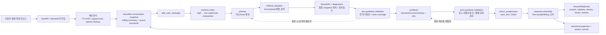

# DocuMate

LangGraph 기반 학습 보조 에이전트입니다. 웹상의 공식 문서와 업로드 파일을 검색해 답변하고, 답변의 각 내용에서 사용한 자료 버전과 원문 위치를 확인할 수 있습니다. FastAPI + Streamlit 런타임에서 같은 답변을 화면에 표시하고 파일 저장·Slack 전송에 사용합니다.

이 저장소는 팀 프로젝트 원형을 그대로 보관한 자료가 아니라, 원본 팀 프로젝트를 단계형 LangGraph 런타임과 120-case benchmark 체계로 재설계한 포트폴리오 개선본입니다. 현재 유지보수 기준은 `src/`, `tests/`, `docs/`, `data/benchmarks/`이며, `archive/`는 원본/legacy 참고 자료를 보관하는 영역입니다.

## 로컬 데모 빠른 실행

이 프로젝트는 FastAPI 백엔드와 Streamlit 데모 UI를 로컬에서 재현 가능하게 실행하는 방식을 기준으로 문서화했습니다.

```bash
uv sync
cp .env.example .env
```

`.env`에는 최소 `OPENAI_API_KEY`, `TAVILY_API_KEY`를 입력해야 합니다. 기본 파일 입력은 `.py`·`.ipynb`입니다. PDF·DOCX·스캔 PDF·이미지의 본문과 표를 검색하려면 [문서 변환 안내](docs/document_ingestion.md)에 따라 `docling` 선택 의존성과 모델을 준비하고 `DOCLING_ENABLED=true`로 실행합니다.

FastAPI와 Streamlit을 함께 실행합니다.

```bash
uv run python -m src.app.service_manager startweb
```

- Streamlit 데모: `http://127.0.0.1:8501`
- FastAPI 서버: `http://127.0.0.1:8000`
- 런타임 로그: `output/runtime/fastapi.log`, `output/runtime/streamlit.log`

데모 확인이 끝나면 아래 명령으로 두 프로세스를 정리합니다.

```bash
uv run python -m src.app.service_manager stopweb
```

직접 실행 명령, 환경 변수 전체 목록, API 계약, 파일 업로드 제약은 [런타임 참고 문서](docs/runtime_reference.md)에 정리했습니다.

## 실제 앱 데모

아래 GIF는 2026-05-05 KST에 Streamlit 화면을 실제 Edge 렌더링으로 캡처한 데모입니다. 라이트/다크 테마, 질문 입력창 옆 파일 첨부, 사이드바를 접은 상태의 질문 제출과 답변 수신 흐름을 보여줍니다. 현재의 본문별 인용·원문 위치 표시가 적용되기 전 화면이며, 현재 응답 계약은 [런타임 참고 문서](docs/runtime_reference.md#5-api-계약)를 기준으로 합니다.


사이드바를 접은 상태로 질문에 대한 답변을 받은 최종 화면은 정적 스크린샷으로도 확인할 수 있습니다.


## 주요 개선 포인트

DocuMate에서 중점적으로 개선한 범위는 단순한 챗봇 구현보다, 실행 경로와 검증 기준을 다시 세운 것입니다. 원본의 tool-call 중심 흐름을 `src/runtime`의 단계형 LangGraph 런타임으로 바꾸고, `src/eval`과 `data/benchmarks` 기반 120-case benchmark로 품질 변화를 비교 가능하게 만들었습니다.

- `chatbot + ToolNode` 중심 흐름을 `planner → retrieval → validation → synthesis → action` 단계형 LangGraph 파이프라인으로 재구성했습니다.
- 공식 문서 검색과 업로드 파일 검색을 `docs`, `upload` route로 분리하고, 검색 순위·점수와 원문 근거를 구분했습니다.
- LLM은 `AnswerDocument.blocks`에 표시할 내용을 한 번만 생성합니다. 서버는 같은 문장·코드·목록 항목·표 셀·제목을 검사해 인용, 확인 상태, 제한 사항을 파생합니다.
- 인용은 내용 hash와 parser 설정으로 식별한 문서 snapshot, 원문 요소, 선택 범위를 보존합니다. 검색 범위를 줄이거나 업로드 파일을 바꿔도 기존 답변의 근거가 다른 원문으로 바뀌지 않습니다.
- 업로드 인덱스는 원문을 chunk마다 복제하지 않습니다. 원문 구조를 한 번 보관하고 검색된 범위만 근거로 복원해 인용에 연결합니다.
- Streamlit과 online benchmark가 공용 클라이언트에서 요청 구성, 첨부 준비·동기화, SSE 처리, 최종 답변·첨부 상태 검증을 공유합니다. 벤치마크는 같은 세션의 실제 준비 질문과 후속 질문을 재생하고, 세션 TTL/LRU와 요청 lock을 포함한 일반 FastAPI 실행 경로를 사용합니다.
- 장기 대화는 고정 예산 rolling summary와 최근 canonical Human/AI 메시지로 유지합니다. 발화 ID와 정확한 원문은 최근 16개 및 보류 계약이 참조하는 발화를 별도로 보존하고, 응답 조립 성공 후에만 세션에 반영합니다.
- 모델은 본문 작업 타입·사용자 의도·참조 선택자를 해석하고, 서버는 원문 범위·답변 hash·요청 revision을 확정합니다. 부족한 정보가 있어도 이미 확인한 금지·의사·출력 조건을 보존하며 재검색·재합성·전달은 같은 계약을 소비합니다.
- 120-case online release benchmark와 pytest 회귀 테스트를 통해 pass rate, citation compliance, latency, 비용을 추적합니다.

구조를 이렇게 나눈 이유와 주요 트레이드오프는 [설계 판단 기록](docs/design_rationale.md)에 정리했습니다. 실행 방법, 환경 변수, API 계약, 파일 제약, 운영 메모는 [런타임 참고 문서](docs/runtime_reference.md)를 참고하세요.

### 원본 대비 개선 요약

`archive/`에 보관한 팀 프로젝트 원형과 legacy 코드는 참고 자료로 남기고, 현재 실행 기준은 재구성한 `src/`, `tests/`, `docs/`, `data/benchmarks/`로 분리했습니다. 아래 표는 포트폴리오 개선본에서 의도적으로 바꾼 지점을 요약합니다.

| 비교 항목 | Before: 원형/legacy 기준 | After: 현재 포트폴리오 기준 | 개선 효과 |
|---|---|---|---|
| 실행 흐름 | 모델 tool call과 개별 라우터 실험 중심 | `planner → retrieval → validation → synthesis → action` LangGraph 파이프라인 | 단계별 책임과 재시도 조건을 추적 가능 |
| 검색 출처 | 검색/RAG 결과가 한 흐름에 섞이기 쉬움 | `docs`, `upload` route와 diagnostics, 문서 snapshot·원문 선택·검색 점수 분리 | 자료 버전·위치와 검색 실패·지연을 각각 추적 |
| 답변 형식 | 자연어 응답 중심 | `AnswerDocument` 본문과 서버가 만든 citations·checks·issues·actions | 표시하는 내용을 직접 검사하고 UI·저장·전송에 같은 본문 사용 |
| 웹 런타임 | 데모 UI와 백엔드 실행 기준이 느슨하게 분리 | UI와 benchmark가 공용 첨부·질문·응답 클라이언트 사용 | 다중 턴 문맥과 첨부 revision을 포함해 실제 사용자 실행 경로로 평가 |
| 세션/파일 처리 | 업로드 파일과 생성 파일의 수명 관리가 약함 | 세션별 manager cache, TTL/LRU, 요청 lock, 업로드/출력 cleanup | 사용자별 업로드 격리와 반복 실행 안정성 강화 |
| 장기 대화 메모리 | 원문 history가 계속 누적되거나 생성한 summary가 다음 요청에서 사라질 수 있음 | high/low watermark, bounded rolling summary, reducer 삭제, canonical Human/AI projection, atomic commit | 대화 prompt·요약의 예산을 검증하고 Tool payload 재주입을 차단. 정확한 참조용 원문은 최근 16개와 보류 계약의 참조 발화를 별도 보존 |
| 검증 체계 | 수동 확인과 일부 실험 결과 중심 | pytest 회귀 테스트 + 120-case online release benchmark | pass rate, citation compliance, latency, 비용을 변경마다 비교 가능 |

### 핵심 graph 다이어그램


```mermaid
flowchart LR
    User["사용자 질문/파일 업로드"] --> API["FastAPI / Streamlit 런타임"]
    API --> Session["세션 관리<br/>TTL/LRU, request lock, upload cleanup"]
    Session --> Memory["bounded conversation snapshot<br/>rolling summary + recent Human/AI"]
    Memory --> Add["add_user_message"]
    Add --> Compact["memory policy<br/>high → low watermark compaction"]
    Compact --> Planner["planner<br/>의도/route 결정"]
    Planner --> Retrieval["retrieve_dispatch<br/>docs/upload 병렬 검색"]
    Retrieval --> Evidence["SearchHit + diagnostics<br/>원문 snapshot·위치 / 검색 점수"]
    Evidence --> PreCheck["pre-synthesis validation<br/>검색 가용성 / route coverage"]
    PreCheck --> Synthesis["synthesis<br/>AnswerDocument.blocks + refs"]
    Synthesis --> PostCheck["post-synthesis validation<br/>표시 내용의 참조 / 발췌 일치 검사"]
    PostCheck --> Action["action_postprocess<br/>save_text / Slack"]
    Action --> Assembly["response assembly<br/>Tool receipt/debug 소비"]
    Assembly --> Response["AnswerResponse<br/>content, citations, checks, issues, actions"]
    Assembly --> Commit["canonical projection + atomic commit"]
    Commit --> Memory

    PreCheck -. "필요 시 선택적 재검색" .-> Planner
    PostCheck -. "원문 재사용 재합성" .-> Synthesis
```

## 핵심 기능

| 기능 | 설명 |
|---|---|
| 공식 문서 검색 | allowlist와 query hint를 기준으로 공식 문서 결과를 검색하며, provider가 제공한 발췌의 snapshot과 수집 범위를 보존합니다. |
| 업로드 파일 검색 | `.py`·`.ipynb` 및 선택적으로 PDF·DOCX·이미지를 한 세션에 추가·삭제·교체하고 검색합니다. 코드 원문 줄·Notebook cell ID·문서 페이지·표 셀과 자료 버전을 보존합니다. 기본 한도는 10개·파일당 10 MiB·합계 50 MiB입니다. |
| 구조화 응답 | 단일 본문을 문단·제목·목록·코드·표로 표시하고 관련 내용 옆에서 인용한 원문을 확인합니다. |
| 검증/재시도 | 같은 본문의 참조 유효성, 원문 발췌 일치, 요청한 형식·출처 범위를 검사합니다. 일반 설명의 의미적 근거성은 별도 평가하지 않았다고 표시합니다. |
| 액션 후처리 | 같은 본문과 출처를 텍스트 파일·Slack으로 내보내고 실제 실행 결과는 별도 receipt로 표시합니다. |
| bounded 대화 메모리 | rolling summary와 최근 Human/AI turn을 token·UTF-8 byte·message·turn 예산 안에 유지하고, 오래된 Tool payload는 세션에 저장하지 않습니다. |
| 관측성 | `include_debug=true`에서 latency breakdown, diagnostics, retry context, LLM call metadata를 확인할 수 있습니다. |

## 구현 개요

주요 기준 경로는 `src/runtime/graph_builder.py`, `src/runtime/make_graph.py`, `src/infra/tools/*`, `src/runtime/nodes/*`, `src/app/web/*`, `src/eval/*`입니다.

- `src/app/`: 공용 클라이언트·첨부 준비, FastAPI/Streamlit 웹 런타임, 서비스 매니저, 세션별 `AgentFlowManager`
- `src/core/`: `GraphState`, bounded conversation memory 정책, parser 독립 문서·근거 모델, `AnswerDocument`와 응답·진단 계약
- `src/infra/`: 설정, LLM registry, Chroma 기반 업로드 검색, Tavily docs search, Slack/save 도구
- `src/runtime/`: LangGraph 조립과 session/planner/retrieval/validation/synthesis/action 노드
- `src/eval/`: 공용 클라이언트 기반 시나리오 재생·결과 수집, scoring, report/history 생성. 첨부·질문·전체 시나리오 시간을 구분하고 실행·측정 계약과 fixture fingerprint가 같은 이력만 비교

Docling은 요청에 종속된 로컬 프로세스에서 문서를 변환하고 기존 `ParsedDocument`로 연결합니다. 기본 OCR은 실제 한영 표본에서 비교한 RapidOCR 한국어 모델이며, 인식 오류·누락 가능성을 생성과 출처 표시에 전달합니다. 변환·임베딩 캐시는 세션 안에서만 공유하고 파일별 식별자를 다시 연결합니다. 실패·부분 성공·시간 초과는 기존 첨부를 유지합니다. 인용한 원문 요소는 응답에 보존하지만 원본 파일의 영구 보관소와 PDF 페이지 뷰어는 제공하지 않습니다. 구현 계약·OCR 측정 범위·재현 방법은 [문서 변환 안내](docs/document_ingestion.md)를 참고하세요.

## 검증 결과

회귀 테스트는 2026-09-13 KST에 Docling 선택 의존성을 설치하고 `LIVE_TEST=false`, `RUN_DOCLING_TESTS=0`으로 실행한 결과입니다. 별도로 실제 로컬 모델을 사용하는 문서 변환·검색·인용 검증은 `19 passed`였고, Docling을 제거한 기본 설치에서도 앱 생성과 회귀 검사(`1218 passed, 117 skipped, 69 subtests passed`)를 확인했습니다. 아래 `release` benchmark 수치는 `20260509_043436` 런의 기록입니다. 이 release 기록은 현재 응답·평가 계약이나 공용 클라이언트 시나리오로 실행한 결과가 아닙니다. 새 계약의 품질은 별도 release run으로 확인해야 하며, 평가 기준이 다른 수치를 직접 비교하지 않습니다. 로컬 benchmark 실행은 `output/benchmarks/latest_release_run.txt`를 최신 `release` run 포인터로 갱신합니다.

| 항목 | 결과 |
|---|---:|
| 테스트 | `1239 passed, 120 skipped, 69 subtests passed` |
| release benchmark | `116/120` cases passed |
| release pass rate | `0.9667` |
| tool precision / recall | `0.9677` / `1.0000` |
| citation compliance | `0.9556` |
| p95 latency | `9435.9 ms` |
| avg cost per case | `$0.00523362` |

기록된 당시의 comparable generated-suite에서 pass rate는 `0.3833`에서 `0.9667`로, citation compliance는 `0.3056`에서 `0.9556`으로 올라갔고 p95 latency는 `62063.0 ms`에서 `9435.9 ms`로 줄었습니다.

공용 클라이언트 전환은 실제 localhost FastAPI·그래프·검색·파일 저장과 외부 모델/임베딩 대체 경계로 검증했습니다. 두 파일의 근거를 포함한 준비 답변과 후속 저장 결과가 같고, 새 사례에 이전 대화·첨부가 유입되지 않는지 확인했습니다. Streamlit 최소 지원 버전 `1.54.0`의 격리 환경 UI 검사도 `83 passed`입니다. 유료 모델·검색·judge를 사용하는 새 release run과 실서비스 Slack 전송은 실행하지 않았습니다.

추세 그래프는 [docs/assets/benchmark_history.svg](docs/assets/benchmark_history.svg)에 보관합니다. 실행 방법은 [벤치마크 가이드](docs/benchmarking.md)를 참고하세요. 로컬 run의 기계 판독 결과와 상세 분석은 각각 `output/benchmarks/<run_id>/summary.json`, `output/benchmarks/<run_id>/report.md`에서 확인합니다.

## 요청 계약 검증

RequestContract v2 해석 평가에서는 `gpt-5.6-luna`, 출력 한도 1920, `temperature=0`으로 42개 사례를 각 3회 실행했습니다. 두 전체 배치 결과는 각각 **88/126**, 구조 수정 후 **103/126** 통과이며, 두 번째 계약 수용률은 **122/126**입니다. 사전에 정한 전체 성공률 95%·계약 수용률 99%·기존 사례 모두 3/3 성공 기준에는 미달했습니다. 금지 행동 승격 등 심각 실패는 두 배치에서 0건이었습니다.

마지막 목적지 보존 수정 후 같은 원시 응답을 재검증한 **105/126**은 새 모델 호출이 없는 오프라인 결과입니다. 최초 v1 **12/21 통과·9/21 실패**는 별도 정책 이력으로 유지하며 v2와 직접 비교하지 않습니다. 이 평가는 planner 해석 범위이며 현재 계약으로 전체 120-case release benchmark를 다시 실행한 결과가 아닙니다. 실행별 근거와 한계는 [요청 계약 평가 기록](docs/benchmarking.md#261-현재-검증-기록)에 정리했습니다.

## 문서

- [런타임 참고 문서](docs/runtime_reference.md): 설치, 실행, 환경 변수, API 계약, 파일 제약, 운영 메모
- [설계 판단 기록](docs/design_rationale.md): 구조를 나눈 이유, latency/retrieval 품질 문제, 주요 트레이드오프
- [벤치마크 가이드](docs/benchmarking.md): online benchmark 실행, 로컬 run 산출물, README release 요약과 history SVG 갱신
- [에러 코드](docs/error_codes.md): debug payload와 benchmark에서 쓰는 주요 error code
- [보관 자료 안내](archive/README.md): 팀 프로젝트 원형과 legacy 자료 위치
