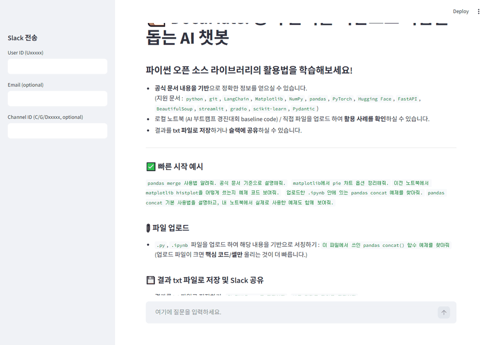
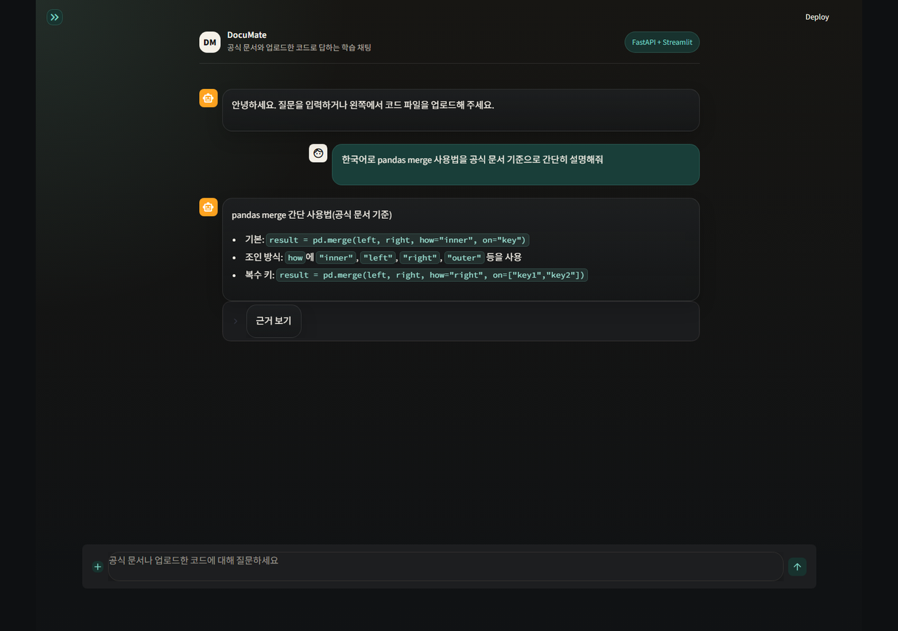

# DocuMate

LangGraph 기반 학습 보조 에이전트입니다. 공식 문서 검색, 로컬 노트북 RAG, 세션 업로드 파일 검색, 구조화된 grounded 응답, 저장/Slack 전송 액션을 하나의 FastAPI + Streamlit 런타임으로 묶어 제공합니다.

이 저장소는 팀 프로젝트 원형을 그대로 보관한 자료가 아니라, 개인 포트폴리오 프로젝트로 분리한 뒤 실행 경로와 검증 체계를 다시 설계한 개선본입니다. 현재 유지보수 기준은 `src/`, `tests/`, `docs/`, `data/benchmarks/`이며, `archive/`는 참고용 보관 영역입니다.

## 실제 앱 데모

아래 GIF는 2026-05-05 KST에 현재 Streamlit 화면을 실제 Edge 렌더링으로 캡처한 데모입니다. 라이트/다크 테마, 질문 입력창 옆 파일 첨부, 사이드바를 접은 상태의 질문 제출과 답변 수신 흐름을 함께 보여줍니다.

사이드바를 접은 상태로 질문에 대한 답변을 받은 최종 화면은 정적 스크린샷으로도 확인할 수 있습니다.

## 포트폴리오 핵심

DocuMate에서 중점적으로 개선한 범위는 단순한 챗봇 구현보다 실행 경로, 근거 품질, 검증 가능성을 명확히 만드는 데 있습니다.

- `chatbot + ToolNode` 중심 흐름을 `planner → retrieval → validation → synthesis → action` 단계형 LangGraph 파이프라인으로 재구성했습니다.
- 공식 문서 검색, 로컬 노트북 RAG, 업로드 파일 검색을 `docs`, `local`, `upload` route로 분리하고 evidence payload와 diagnostics를 정규화했습니다.
- 최종 답변을 `answer`, `claims`, `evidence`, `confidence`, `sections` 기반의 grounded response schema로 정리했습니다.
- FastAPI와 Streamlit을 같은 런타임 경로에 연결하고, 세션 TTL/LRU, 요청 lock, SSE progress, 업로드/생성 파일 cleanup을 구현했습니다.
- 120-case online release benchmark와 pytest 회귀 테스트를 통해 pass rate, citation compliance, latency, 비용을 추적합니다.

구조를 이렇게 나눈 이유와 주요 트레이드오프는 [설계 판단 기록](docs/design_rationale.md)에 정리했습니다. 실행 방법, 환경 변수, API 계약, 파일 제약, 운영 메모는 [런타임 참고 문서](docs/runtime_reference.md)를 참고하세요.

## 핵심 기능

| 기능 | 설명 |
|---|---|
| 공식 문서 검색 | allowlist와 query hint를 기준으로 공식 문서 결과만 evidence로 사용합니다. |
| 로컬 노트북 RAG | `data/index` Chroma 인덱스를 통해 로컬 노트북 지식을 검색합니다. |
| 업로드 파일 검색 | 현재 세션에 업로드된 `.py` 또는 `.ipynb` 파일만 임시 retriever로 검색합니다. |
| 구조화 응답 | claim과 evidence를 함께 유지하는 grounded response payload를 반환합니다. |
| 검증/재시도 | evidence 품질과 route coverage를 확인하고 필요한 경우 선택적으로 재검색합니다. |
| 액션 후처리 | 요청에 따라 답변을 텍스트 파일로 저장하거나 Slack에 전송합니다. |
| 관측성 | `include_debug=true`에서 latency breakdown, diagnostics, retry context, LLM call metadata를 확인할 수 있습니다. |

## 구현 개요

주요 기준 경로는 `src/runtime/graph_builder.py`, `src/runtime/make_graph.py`, `src/infra/tools/*`, `src/runtime/nodes/*`, `src/app/web/*`, `src/eval/*`입니다.

- `src/app/`: CLI, FastAPI/Streamlit 웹 런타임, 서비스 매니저, 세션별 `AgentFlowManager`
- `src/core/`: `GraphState`, planner/response/debug 계약, evidence 모델, 응답 스키마
- `src/infra/`: 설정, LLM registry, Chroma/RAG, Tavily docs search, Slack/save 도구
- `src/runtime/`: LangGraph 조립과 session/planner/retrieval/validation/synthesis/action 노드
- `src/eval/`: online benchmark, scoring, report/history 생성

## 검증 결과

최신 문서화된 release benchmark는 `20260509_043436` 런입니다.

| 항목 | 결과 |
|---|---:|
| 테스트 | `390 passed, 54 subtests passed` |
| release benchmark | `116/120` cases passed |
| release pass rate | `0.9667` |
| tool precision / recall | `0.9677` / `1.0000` |
| citation compliance | `0.9556` |
| p95 latency | `9435.9 ms` |
| avg cost per case | `$0.00523362` |

상세 결과와 해석은 [벤치마크 결과](docs/benchmark_results.md), 실행 방법은 [벤치마크 가이드](docs/benchmarking.md)를 참고하세요.

## 문서

- [런타임 참고 문서](docs/runtime_reference.md): 설치, 실행, 환경 변수, API 계약, 파일 제약, 운영 메모
- [설계 판단 기록](docs/design_rationale.md): 구조를 나눈 이유, latency/retrieval 품질 문제, 주요 트레이드오프
- [벤치마크 가이드](docs/benchmarking.md): online benchmark 실행과 report/history 생성
- [벤치마크 결과](docs/benchmark_results.md): 최신 release run 지표와 해석
- [에러 코드](docs/error_codes.md): debug payload와 benchmark에서 쓰는 주요 error code
- [변경 이력](CHANGELOG.md): 현재 baseline과 변경 내역
- [보관 자료 안내](archive/README.md): 팀 프로젝트 원형과 legacy 자료 위치
