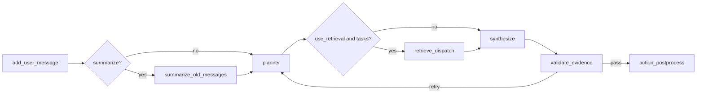

# DocuMate

LangGraph 기반 학습 보조 에이전트입니다. 현재 프로젝트는 공식 문서 검색, 로컬 노트북 RAG, 세션 업로드 파일 검색, 구조화된 응답 스키마, 저장/Slack 전송 액션을 하나의 FastAPI + Streamlit 런타임으로 묶어 제공합니다.

현재 문서는 실제 동작 코드를 기준으로 정리되어 있습니다. 주요 기준 경로는 `src/graph_builder.py`, `src/make_graph.py`, `src/tools/*`, `src/nodes/*`, `src/web/*`, `src/eval/*`입니다.

- [벤치마크 가이드](docs/benchmarking.md)
- [변경 이력](CHANGELOG.md)
- [보관 자료 안내](archive/README.md)

## 1. 핵심 기능

| 기능 | 설명 |
|---|---|
| 공식 문서 검색 | `tavily_search`가 `src/config/agent_rules.toml`의 allowlist와 query hint를 기준으로 공식 문서만 검색합니다. |
| 로컬 노트북 RAG | `src.rag_build`가 `data/`와 `uploads/` 아래 `.ipynb`를 인덱싱하고 `rag_search`가 `data/index`를 조회합니다. |
| 업로드 파일 검색 | 현재 세션에 업로드된 `.py` 또는 `.ipynb` 파일만 임시 retriever로 검색합니다. |
| 세션 메모리 | FastAPI 런타임에서 세션별 `AgentFlowManager`를 유지하고 TTL/LRU 기준으로 정리합니다. |
| grounded 응답 | 응답은 `answer`, `claims`, `evidence`, `confidence`, `sections`를 포함하는 구조화된 페이로드로 반환됩니다. |
| 검증 및 선택적 재시도 | evidence 검증 결과에 따라 planner 단계로 되돌아가 재검색할 수 있습니다. |
| 액션 도구 | 요청에 따라 `save_text`로 텍스트 파일을 저장하거나 `slack_notify`로 Slack에 전송할 수 있습니다. |
| 디버그/관측성 | `include_debug=true`일 때 latency, planner/retrieval diagnostics, retry context, LLM call metadata를 함께 반환합니다. |

## 2. 실행 흐름

현재 그래프는 아래 순서로 동작합니다.


```mermaid
flowchart LR
    A["add_user_message"] --> B{"summarize?"}
    B -- yes --> C["summarize_old_messages"]
    B -- no --> D["planner"]
    C --> D
    D --> E{"use_retrieval and tasks?"}
    E -- yes --> F["retrieve_dispatch"]
    E -- no --> G["synthesize"]
    F --> G
    G --> H["validate_evidence"]
    H -- retry --> D
    H -- pass --> I["action_postprocess"]
```

주요 조립 지점은 다음과 같습니다.

- `src/graph_builder.py`: settings, tool registry, LLM registry, stage instrumentation을 결합합니다.
- `src/make_graph.py`: LangGraph 노드와 라우팅 규칙을 정의합니다.
- `src/nodes/planner/`: retrieval 필요 여부와 route를 결정합니다.
- `src/nodes/retrieval/`: docs, upload, local route를 실행하고 결과를 정규화합니다.
- `src/nodes/synthesis/`: 구조화된 grounded 응답을 생성합니다.
- `src/nodes/validation/`: claim/evidence 일치 여부를 검증하고 retry 여부를 결정합니다. 공개 엔트리는 `src.nodes.validation`이며 세부 정책은 패키지 내부 모듈로 분리되어 있습니다.
- `src/nodes/actions/`: 파일 저장과 Slack 전송 후처리를 담당합니다.

## 3. 빠른 시작

### 3.1 요구 사항

- Python 3.12 이상
- `uv`
- OpenAI API 키
- Tavily API 키

### 3.2 설치

```bash
uv sync
```

### 3.3 환경 변수 준비

```bash
# macOS / Linux
cp .env.example .env

# Windows PowerShell
Copy-Item .env.example .env
```

필수 값:

- `OPENAI_API_KEY`
- `TAVILY_API_KEY`

선택 값:

- `SLACK_BOT_TOKEN`
- `SLACK_DEFAULT_USER_ID`
- `SLACK_DEFAULT_DM_EMAIL`

`src.settings.validate_required_keys()` 때문에 CLI, FastAPI, `startweb` 실행 시 현재는 `OPENAI_API_KEY`와 `TAVILY_API_KEY`가 모두 필요합니다.

### 3.4 로컬 노트북 인덱스 생성

```bash
uv run python -m src.rag_build
```

이 명령은 `data/`와 `uploads/` 아래의 `.ipynb` 파일을 스캔해 `data/index`에 Chroma 인덱스를 만듭니다.

### 3.5 CLI 실행

```bash
uv run python -m src.cli
```

그래프 이미지를 덤프하려면:

```bash
uv run python -m src.cli --dump-graph output/runtime/graph.png
```

### 3.6 웹 서비스 실행

권장 방식:

```bash
uv run python -m src.service_manager startweb
uv run python -m src.service_manager stopweb
```

- FastAPI: `http://localhost:8000`
- Streamlit: `http://localhost:8501`
- 런타임 로그: `output/runtime/fastapi.log`, `output/runtime/streamlit.log`
- 상태 파일: `output/runtime/web_services_state.json`

직접 실행도 가능합니다.

```bash
uv run python -X utf8 -m uvicorn src.web.app:app --host 0.0.0.0 --port 8000
uv run python -X utf8 -m streamlit run src/web/streamlit_app.py --server.port 8501
```

Windows 환경에서는 `-X utf8` 또는 `PYTHONUTF8=1` 사용을 권장합니다. `src.cli`, `src.service_manager`, `src.web.app`는 UTF-8 실행을 우선하도록 구성돼 있습니다.

## 4. 환경 변수

### 4.1 애플리케이션 설정

기준 파일:

- 기본값 source of truth: `src/settings.py`
- 예시 환경 파일: `.env.example` (생성 산출물)
- 동기화 명령: `uv run python script/sync_env_example.py`

| 이름 | 기본값 | 설명 |
|---|---|---|
| `OPENAI_API_KEY` | 없음 | OpenAI 호출과 임베딩 생성에 필요 |
| `TAVILY_API_KEY` | 없음 | 공식 문서 검색에 필요 |
| `CHAT_MODEL` | `gpt-5.4-nano` | synthesis 모델 기본값 |
| `PLANNER_MODEL` | `gpt-5.4-nano` | planner 모델 기본값 |
| `SUMMARY_MODEL` | `gpt-5.4-nano` | session summary 모델 기본값 |
| `PLANNER_MAX_TOKENS` | `1920` | planner structured output 최대 토큰 |
| `DOCS_SEARCH_TIMEOUT_SECONDS` | `8` | Tavily 검색 timeout |
| `SYNTHESIS_TIMEOUT_SECONDS` | `20` | synthesis timeout |
| `SYNTHESIS_MAX_RETRIES` | `0` | synthesis 자체 재시도 횟수 |
| `SYNTHESIS_MAX_TOKENS` | `1920` | synthesis max tokens |
| `SYNTHESIS_PROMPT_SNIPPET_CHARS` | `960` | evidence snippet 길이 제한 |
| `VERBOSE` | `true` | CLI 로그 상세 출력 |
| `FASTAPI_URL` | `http://localhost:8000` | Streamlit이 호출하는 API 주소 |
| `SESSION_TTL_SECONDS` | `1800` | 세션 TTL |
| `MAX_ACTIVE_SESSIONS` | `200` | 최대 활성 세션 수 |
| `SESSION_CLEANUP_INTERVAL_SECONDS` | `60` | 세션 정리 주기 |
| `GENERATED_FILE_TTL_SECONDS` | `86400` | `save_text` 결과 파일 TTL |
| `FILE_CLEANUP_INTERVAL_SECONDS` | `60` | 업로드/생성 파일 정리 주기 |
| `SLACK_BOT_TOKEN` | 없음 | Slack 전송용 토큰 |
| `SLACK_DEFAULT_DM_EMAIL` | 없음 | 기본 DM 대상 이메일 |
| `SLACK_DEFAULT_USER_ID` | 없음 | 기본 DM 대상 사용자 |

### 4.2 벤치마크 설정

기준 파일:

- 기본값 source of truth: `data/benchmarks/config.toml`
- 환경 변수 override 정의: `src/settings.py`
- 예시 환경 파일: `.env.example` (config 값을 복사한 override 예시)
- 동기화 명령: `uv run python script/sync_env_example.py`

| 이름 | 기본값 | 설명 |
|---|---|---|
| `JUDGE_MODEL` | `gpt-5.4-nano` | benchmark judge 모델 override |
| `BENCHMARK_ENDPOINT` | `http://localhost:8000` | benchmark 대상 FastAPI 주소 override |
| `BENCHMARK_JUDGE_ENABLED` | `true` | judge 사용 여부 override |

## 5. 검색 소스와 파일 제약

### 5.1 공식 문서 검색

UI와 문서 검색 규칙은 아래 파일을 기준으로 관리합니다.

- `src/domain_docs.py`: Streamlit 소개 영역에 노출하는 기본 문서 목록
- `src/config/agent_rules.toml`: docs allowlist, intent rule, query hint 규칙

현재 기본 문서 소스는 Python, Git, LangChain, Matplotlib, NumPy, pandas, PyTorch, Hugging Face, FastAPI, BeautifulSoup, Streamlit, Gradio, scikit-learn, Pydantic입니다.

### 5.2 업로드 파일

- 허용 확장자: `.py`, `.ipynb`
- 허용 위치: `uploads/<session_id>/...`
- 검증 기준: `src/web/cleanup.py::validate_upload_file_path`
- 현재 업로드 검색은 세션에 연결된 단일 파일 컨텍스트만 사용합니다.

### 5.3 생성 파일과 정리 정책

- `save_text` 결과: `output/save_text/*.txt`
- 다운로드 엔드포인트: `GET /download/{filename}`
- 세션 업로드 정리: `SESSION_TTL_SECONDS`
- 생성 파일 정리: `GENERATED_FILE_TTL_SECONDS`
- 정리 로직: `src/web/cleanup.py::RuntimeCleaner`

## 6. API 계약

### 6.1 `POST /agent`

요청 예시:

```json
{
  "query": "업로드한 파일에서 groupby가 어디에 쓰였는지 보여줘",
  "session_id": "demo-session",
  "upload_file_path": "uploads/demo-session/sales_analysis.py",
  "include_debug": true,
  "slack_user_id": "U12345678",
  "slack_email": "user@example.com",
  "slack_channel_id": "C12345678"
}
```

주요 규칙:

- `session_id`는 세션 캐시 키로 사용됩니다.
- `upload_file_path`는 반드시 `uploads/<session_id>/...` 범위 안이어야 합니다.
- `include_debug=true`일 때만 debug payload가 내려옵니다.
- Slack 필드는 세션 메타데이터로 저장되며 후속 요청에서 재사용될 수 있습니다.

응답 구조:

```json
{
  "response": {
    "answer": "문장 단위 답변 [1]",
    "claims": [],
    "evidence": [],
    "confidence": 0.42,
    "sections": []
  },
  "trace": "Session ID: ..., Request ID: ..., Agent ID: ...",
  "file_path": null,
  "debug": null
}
```

`debug`에는 아래 정보가 포함될 수 있습니다.

- `tool_calls`, `tool_call_count`
- `latency_ms_server`, `latency_breakdown`
- `token_usage`, `model_name`, `models_used`, `llm_calls`
- `observed_evidence`
- `retry_context`
- `retrieval_diagnostics`
- `planner_diagnostics`

실제 응답 스키마 기준 파일:

- `src/web/schemas.py`
- `src/answer_schema/`

### 6.2 `GET /download/{filename}`

- `save_text`가 만든 텍스트 파일을 다운로드합니다.
- 경로 순회와 절대 경로는 차단됩니다.
- 파일이 없으면 `404 Not Found`를 반환합니다.

## 7. 프로젝트 구조

```text
.
├─ archive/                    # 보관 코드 및 참고 문서
├─ data/
│  └─ benchmarks/              # benchmark config / fixtures
├─ docs/
│  ├─ assets/
│  └─ benchmarking.md
├─ output/
│  ├─ benchmarks/              # benchmark 결과물
│  ├─ runtime/                 # 서비스 로그와 상태 파일
│  └─ save_text/               # 저장된 응답 파일
├─ script/
│  └─ check_encoding.py
├─ src/
│  ├─ agent_runtime/
│  │  ├─ __init__.py
│  │  ├─ debug_collector.py
│  │  ├─ execution_runner.py
│  │  ├─ response_assembler.py
│  │  └─ session_context.py
│  ├─ config/
│  │  └─ agent_rules.toml
│  ├─ contracts/
│  │  ├─ boundary/
│  │  │  ├─ __init__.py
│  │  │  ├─ debug.py
│  │  │  ├─ graph.py
│  │  │  ├─ planner.py
│  │  │  ├─ response.py
│  │  │  ├─ retrieval.py
│  │  │  └─ runtime.py
│  │  ├─ debug/
│  │  ├─ io/
│  │  ├─ state/
│  │  ├─ __init__.py
│  │  ├─ debug.py
│  │  ├─ graph_state.py
│  │  └─ routes.py
│  ├─ eval/
│  │  ├─ history/
│  │  ├─ reporting/
│  │  │  ├─ __init__.py
│  │  │  ├─ histograms.py
│  │  │  ├─ markdown.py
│  │  │  ├─ summary.py
│  │  │  └─ writer.py
│  │  ├─ online_runner/
│  │  │  ├─ __init__.py
│  │  │  ├─ case_runner.py
│  │  │  ├─ request_builder.py
│  │  │  ├─ response_parser.py
│  │  │  └─ result_builder.py
│  │  ├─ __init__.py
│  │  ├─ generate_cases.py
│  │  ├─ history.py
│  │  ├─ judge_llm.py
│  │  ├─ main.py
│  │  ├─ schemas.py
│  │  └─ scoring_rules.py
│  ├─ nodes/
│  │  ├─ planner/
│  │  │  ├─ __init__.py
│  │  │  ├─ deterministic.py
│  │  │  ├─ guardrails.py
│  │  │  ├─ heuristic.py
│  │  │  ├─ intents.py
│  │  │  ├─ models.py
│  │  │  ├─ node.py
│  │  │  ├─ policy.py
│  │  │  ├─ prompt_builder.py
│  │  │  └─ query_sanitizer.py
│  │  ├─ retrieval/
│  │  │  ├─ __init__.py
│  │  │  ├─ executor.py
│  │  │  ├─ formatting.py
│  │  │  └─ node.py
│  │  ├─ synthesis/
│  │  │  ├─ __init__.py
│  │  │  ├─ context.py
│  │  │  ├─ models.py
│  │  │  ├─ node.py
│  │  │  ├─ payload_builder.py
│  │  │  ├─ pipeline.py
│  │  │  ├─ prompt_builder.py
│  │  │  ├─ short_circuit.py
│  │  │  └─ state.py
│  │  ├─ validation/
│  │  │  ├─ __init__.py
│  │  │  ├─ evidence_validator.py
│  │  │  ├─ hybrid_rewrite.py
│  │  │  ├─ messages_ko.py
│  │  │  ├─ node.py
│  │  │  ├─ policy.py
│  │  │  └─ repair.py
│  │  ├─ __init__.py
│  │  ├─ actions/
│  │  ├─ retry.py
│  │  └─ session.py
│  ├─ service_manager/
│  ├─ tools/
│  │  ├─ __init__.py
│  │  ├─ _common.py
│  │  ├─ docs_search/
│  │  ├─ local_rag/
│  │  ├─ save_text.py
│  │  └─ slack_notify.py
│  ├─ web/
│  │  ├─ .streamlit/
│  │  │  └─ config.toml
│  │  ├─ app.py
│  │  ├─ cleanup.py
│  │  ├─ routes.py
│  │  ├─ schemas.py
│  │  ├─ session_store.py
│  │  ├─ streamlit_api_client.py
│  │  ├─ streamlit_app.py
│  │  ├─ streamlit_chat.py
│  │  ├─ streamlit_page.py
│  │  ├─ streamlit_state.py
│  │  └─ streamlit_upload_handler.py
│  ├─ agent_manager.py
│  ├─ answer_schema/
│  │  ├─ __init__.py
│  │  ├─ fallbacks.py
│  │  ├─ models.py
│  │  ├─ rendering.py
│  │  └─ text_cleaning.py
│  ├─ chunking.py
│  ├─ cli.py
│  ├─ domain_docs.py
│  ├─ evidence.py
│  ├─ graph_builder.py
│  ├─ latency.py
│  ├─ llm.py
│  ├─ logging_utils.py
│  ├─ make_graph.py
│  ├─ message_utils.py
│  ├─ planner_schema.py
│  ├─ prompts.py
│  ├─ rag_build.py
│  ├─ request_contracts.py
│  ├─ rules.py
│  ├─ runtime_encoding.py
│  ├─ runtime_paths.py
│  ├─ sequence_utils.py
│  ├─ settings.py
│  └─ slack_utils.py
├─ tests/
│  ├─ core/
│  ├─ eval/
│  ├─ tools/
│  └─ web/
└─ uploads/                    # 세션 업로드 파일
```

## 8. 운영 메모

- `src.service_manager`는 FastAPI와 Streamlit을 함께 띄우고 종료합니다.
- `src.web.session_store`는 세션별 단일 요청 직렬화 lock을 사용합니다.
- `src.rag_build`는 증분 인덱싱을 위해 `data/index/manifest.json`을 관리합니다.
- benchmark 최신 성능 정본은 `output/benchmarks/latest_release_run.txt`입니다.
- smoke 최신 런 포인터는 `output/benchmarks/latest_smoke_run.txt`로 별도 관리합니다.

## 9. 최신 벤치마크 결과

이 섹션은 `uv run python -m src.eval.main history --track release` 실행 시 자동으로 갱신됩니다.

## 10. 최근 벤치마크 이력 및 추세

이 섹션과 `docs/assets/benchmark_history.svg`도 같은 명령으로 함께 갱신됩니다. smoke 히스토리는 별도 `--readme`, `--svg` 경로를 지정해야 합니다.

## 11. 테스트 및 검증

기본 검증:

```bash
uv run pytest -q
uv run python script/check_encoding.py
uv run python script/sync_env_example.py --check
```

벤치마크 관련 명령은 [docs/benchmarking.md](docs/benchmarking.md)를 참고하세요.
