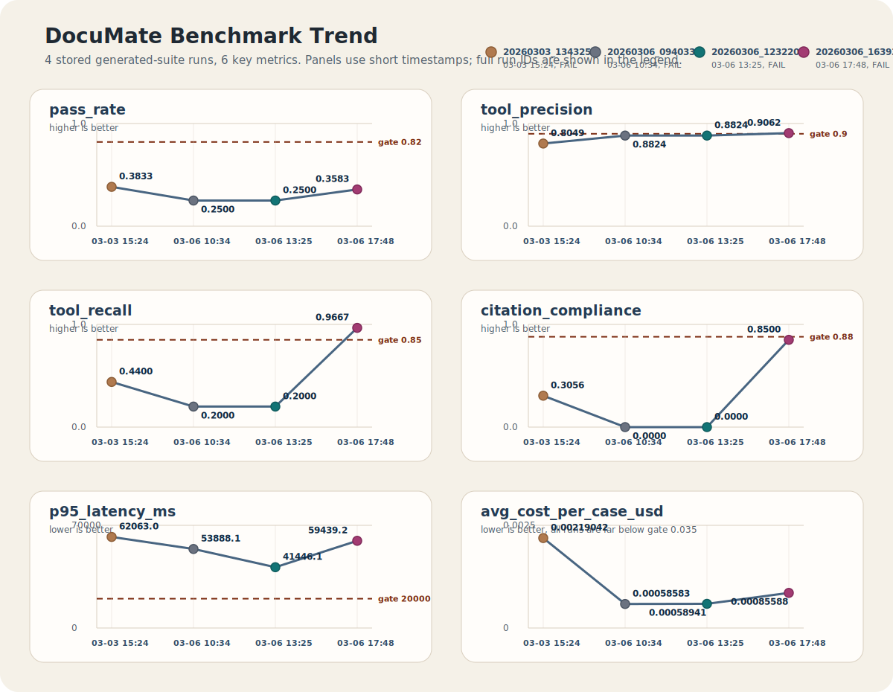

# 벤치마킹 가이드

DocuMate는 `FastAPI /agent` 실경로를 기준으로 하는 온라인 벤치마크를 제공합니다. README에는 검증 현황만 남기고, 상세 실행 방법과 결과 스냅샷은 이 문서에서 관리합니다.

## 1. 실행 흐름

### 1.1 케이스 생성

```bash
uv run python -m src.eval.main generate \
  --seed data/benchmarks/fixtures/cases.seed.jsonl \
  --regression-seed data/benchmarks/fixtures/cases.regression.seed.jsonl \
  --out data/benchmarks/fixtures/cases.generated.jsonl \
  --target 120
```

### 1.2 온라인 실행

```bash
uv run python -m src.eval.main run \
  --mode online \
  --fixtures data/benchmarks/fixtures/cases.generated.jsonl \
  --endpoint http://localhost:8000
```

### 1.3 리포트 재생성

```bash
uv run python -m src.eval.main report --run output/benchmarks/20260307_101108
```

### 1.4 이력 요약

```bash
uv run python -m src.eval.main history
```

## 2. 결과 산출물

- `output/benchmarks/<run_id>/raw_results.jsonl`
- `output/benchmarks/<run_id>/summary.json`
- `output/benchmarks/<run_id>/report.md`
- `output/benchmarks/latest_run.txt`
- 위 경로는 런타임 산출물이며 기본적으로 git 추적 대상에서 제외합니다.

## 3. Hard Gate

| Gate | Threshold |
|---|---:|
| `pass_rate` | 0.82 |
| `tool_precision` | 0.90 |
| `tool_recall` | 0.85 |
| `citation_compliance` | 0.88 |
| `p95_latency_ms` | 20000 |
| `avg_cost_per_case_usd` | 0.01 |

## 4. 최신 저장 런 요약

문서 작성 시점 기준 `output/benchmarks/latest_run.txt`는 `20260308_080336`을 가리키지만 해당 디렉터리는 저장소에 없습니다. 링크가 유효한 최신 완전한 런은 `20260307_101108`이므로, 아래 요약은 그 런을 기준으로 기록합니다.

- run_id: `20260307_101108`
- generated_at_utc: `2026-03-07T11:08:17.965871+00:00`
- endpoint: `http://localhost:8000`
- fixtures: `data\benchmarks\fixtures\cases.generated.jsonl`
- overall: `FAIL`

### 4.1 Metrics

| Metric | Value |
|---|---:|
| total_cases | 120 |
| scored_cases | 120 |
| passed_cases | 44 |
| pass_rate | 0.3667 |
| tool_precision | 0.9091 |
| tool_recall | 1.0000 |
| citation_compliance | 0.8167 |
| p50_latency_ms | 24374.5 |
| p95_latency_ms | 46977.6 |
| avg_cost_per_case_usd | 0.00081372 |

### 4.2 Hard Gate 결과

| Gate | Threshold | Actual | Passed |
|---|---:|---:|:---:|
| pass_rate | 0.82 | 0.3667 | N |
| tool_precision | 0.90 | 0.9091 | Y |
| tool_recall | 0.85 | 1.0000 | Y |
| citation_compliance | 0.88 | 0.8167 | N |
| p95_latency_ms | 20000 | 46977.6 | N |
| avg_cost_per_case_usd | 0.01 | 0.00081372 | Y |

최신 저장 런은 `tool_precision`, `tool_recall`, `avg_cost_per_case_usd` Hard Gate를 통과했지만 `pass_rate`, `citation_compliance`, `p95_latency_ms`는 아직 기준에 못 미칩니다. 개별 리포트 파일은 로컬 `output/benchmarks/` 또는 release artifact에서 확인합니다.

## 5. 최근 이력 및 추세

저장소에 남아 있는 5개 generated-suite 런 기준으로 보면, 최신 `20260307_101108` 런은 직전 `20260306_163931` 대비 `pass_rate` +0.0084, `tool_precision` +0.0029, `tool_recall` +0.0333, `citation_compliance` -0.0333, `p95_latency_ms` -12461.6, `avg_cost_per_case_usd` -0.00004216 변화를 보였습니다. overall 상태는 여전히 `FAIL`입니다.

| run_id | generated_at_utc | overall | pass_rate | tool_precision | tool_recall | citation_compliance | p50_latency_ms | p95_latency_ms | avg_cost_per_case_usd | 변화 |
|---|---|---|---:|---:|---:|---:|---:|---:|---:|---|
| `20260303_134325` | `2026-03-03T15:24:50.806715+00:00` | `FAIL` | 0.3833 | 0.8049 | 0.4400 | 0.3056 | 49835.5 | 62063.0 | 0.00219042 | 기준 런 |
| `20260306_094033` | `2026-03-06T10:34:56.024712+00:00` | `FAIL` | 0.2500 | 0.8824 | 0.2000 | 0.0000 | 14969.0 | 53888.1 | 0.00058583 | `pass_rate -0.1333; tool_precision +0.0775; tool_recall -0.2400; citation_compliance -0.3056; p50_latency_ms -34866.5; p95_latency_ms -8174.9; avg_cost_per_case_usd -0.00160459` |
| `20260306_123220` | `2026-03-06T13:25:46.653810+00:00` | `FAIL` | 0.2500 | 0.8824 | 0.2000 | 0.0000 | 15905.5 | 41446.1 | 0.00058941 | `pass_rate +0.0000; tool_precision +0.0000; tool_recall +0.0000; citation_compliance +0.0000; p50_latency_ms +936.5; p95_latency_ms -12442.0; avg_cost_per_case_usd +0.00000358` |
| `20260306_163931` | `2026-03-06T17:48:12.325082+00:00` | `FAIL` | 0.3583 | 0.9062 | 0.9667 | 0.8500 | 29327.0 | 59439.2 | 0.00085588 | `pass_rate +0.1083; tool_precision +0.0238; tool_recall +0.7667; citation_compliance +0.8500; p50_latency_ms +13421.5; p95_latency_ms +17993.1; avg_cost_per_case_usd +0.00026647` |
| `20260307_101108` | `2026-03-07T11:08:17.965871+00:00` | `FAIL` | 0.3667 | 0.9091 | 1.0000 | 0.8167 | 24374.5 | 46977.6 | 0.00081372 | `pass_rate +0.0084; tool_precision +0.0029; tool_recall +0.0333; citation_compliance -0.0333; p50_latency_ms -4952.5; p95_latency_ms -12461.6; avg_cost_per_case_usd -0.00004216` |



상세 수치는 로컬 `output/benchmarks/` 또는 release artifact 기준으로 다시 확인할 수 있습니다.
